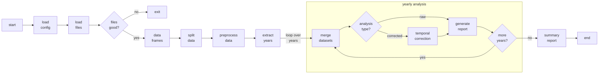

# Table of Contents

1. [Introduction](#introduction)
2. [Running the Program](#running-the-program)
    - [Command Line Arguments](#command-line-arguments)
3. [Output](#output)
4. [Requirements](#requirements)
5. [Installation](#installation)
6. [Usage Example](#usage-example)
7. [Configuration](#configuration)
    - [Overview](#overview)
    - [File Location](#file-location)
    - [Configuration Sections](#configuration-sections)
    - [Configuration Values](#configuration-values)
    - [Default Values](#default-values)
    - [Example Configuration](#example-configuration)
8. [Technical Details and Limitations](#technical-details-and-limitations)
    - [Data Requirements](#data-requirements)
    - [Dependencies](#dependencies)
9. [Downloading Data](#downloading-data)
    - [NOAA Data](#noaa-data)
    - [Lighthouse Data](#lighthouse-data)

## Introduction



**noaa-lighthouse-problem** is a project aimed at assessing the discrepancies between time series water level data from tide gauge stations shared by NOAA and Lighthouse. In coastal Texas, some stations provide data to both organizations, but we have found significant discrepancies in the data available for download from NOAA and Lighthouse. These discrepancies include vertical and temporal offsets, missing values, flatlines, and spikes. Since NOAA sets the standard for data quality, it is crucial to understand why Lighthouse data differs to ensure the quality of water level data from Lighthouse stations not shared by NOAA.

The main program, `analyze_data_discrepancies.py`, uses functions implemented in `file_data_functions.py` to process annual water level data from both NOAA and Lighthouse (downloaded as .csv). It calculates their statistical differences and directly compares the datasets using discrepancy analysis.

These processes are intended to be a starting point for diagnosing any underlying issues that prevent Lighthouse from meeting the standards of NOAA.

**Note:** Not all Lighthouse stations are also NOAA stations. Additionally, Lighthouse stations are only located in coastal Texas, whereas NOAA stations are distributed across the United States. Ensure that you select comparable stations when running the analysis.

## Running the program

Running the main program, `analyze_data_discrepancies.py`, will write statistics and metrics about the compared datasets for a tide gauge station to a text file in the `generated_files` directory, or a directory specified by the user. 

The `data` directory included in the repository has example CSV files that the program can handle. The program can process all of the files in directories `data/lighthouse/[station]` and `data/NOAA/[station]` at once by reading in all the files and sorting the data into years for year-by-year comparison. 

### Command line arguments

- To specify the name of the file to be written to, use command line argument
```shell
--filename myFileName
```

If not specified, the program will write to a text file with a file name generated based on the current timestamp.<br><br>

- To specify the path that the results file should be created in, use command line argument
```shell
--writepath path/to/results/folder
```

If not specified, the program will write the file in the `generated_files` directory by default.<br><br>

- The reference data (NOAA) path and primary data (Lighthouse) path are provided by the user. To specify these paths, use command line arguments
```shell
--refdir path/to/NOAA/files --primarydir path/to/Lighthouse/files
```

These paths should be to water level CSV files for a specific tide gauge station. Ideally, the station and year range chosen for both NOAA and Lighthouse should be the same. However, the program can compare any two stations but will not write results if it cannot find data files for common years. Refer to the files inside the `data` directory as an example.<br><br>

- By default, the program will write messages about the execution of the program at the top of the results text file. To aid in creating these messages, the program will ask the user to input the start and end year of their data. This is an optional feature the user can opt out of using command line argument
```shell
--no-msgs
``` 

## Output

The program generates a text file in the `generated_files` directory or directory specified by the user, containing the annual statistics and metrics of the compared datasets. The output filename is either user-specified or generated based on the current timestamp. Some example results are available to view in `generated_files`. The user may configure the metrics by customizing field values in the `config.json` file.

## Requirements

Python 3.x<br>
Required packages (listed in `requirements.txt`)

## Installation

1. Clone the repository:
```shell
git clone https://github.com/ncail/noaa-lighthouse-problem.git
cd noaa-lighthouse-problem
```
2. Install the required packages:
```shell
pip install -r requirements.txt
```

## Usage example

1. Navigate to the project directory:
```shell
cd path/to/noaa-lighthouse-problem
```
2. Run the program:
```shell
python analyze_data_discrepancies.py --refdir path/to/NOAA/files --primarydir path/to/Lighthouse/files --filename results
```

## Configuration

### Overview

The `config.json` file is used to configure various parameters that define the metrics extracted from the discrepancy analysis of the datasets, and how corrections should be done on the primary data to resolve discrepancies (in development).

### File location

Place the `config.json` file in the root directory of your project.

### Configuration sections

- **Primary data column names**
    - `datetime`: Name of the datetime column in the primary data CSV files.
    - `water_level`: Name of the water level column in the primary data CSV files.

- **Reference data column names**
    - `datetime`: Name of the datetime column in the reference data CSV files.
    - `water_level`: Name of the water level column in the reference data CSV files.

- **Filter offsets by duration parameters**
    - `threshold`: The duration required for an offset to persist for it to be quantified in the results file. 
    - `type`: Specifies if the threshold is a minimum or maximum cutoff.
    - `is_strict`: Specifies if the threshold is exclusive (strict) or inclusive.

- **Filter gaps by duration parameters**
    - `threshold`: The duration required for a gap (missing values) to persist for it to be quantified in the results file (the total missing values are also provided in the results). 
    - `type`: Specifies if the threshold is a minimum or maximum cutoff.
    - `is_strict`: Specifies if the threshold is exclusive (strict) or inclusive.

- **Filter offsets by value parameters**
    - `threshold`: The value of an offset required for it to be quantified in the results file.
    - `use_abs`: Specifies to use the absolute values of offsets to determine if they meet the threshold criteria.
    - `type`: Specifies if the threshold is a minimum or maximum cutoff.
    - `is_strict`: Specifies if the threshold is exclusive (strict) or inclusive.

- **Offset correction parameters**
    - `number_of_intervals`: The number of intervals required for a discrepancy to persist for it to be identified as an offset. This is used to determine temporal and vertical offset corrections, and is unrelated to the filter by duration processes.

### Configuration values

- `datetime`: Examples include: "Date Time", "myDateTimeColumn".
- `water_level`: Examples include: "Water Level", "myWaterLevelColumn".
- `threshold` (duration): Examples include:  "1 week", "2 days, 12 hours", "30 minutes".
- `threshold` (numeric): Must be numeric. Examples include: 0.05, 10.0.
- `type`: Must be either "min" or "max".
- `use_abs`: Must be `true` or `false`.
- `is_strict`: Must be `true` or `false`.

### Default values

Default values are used if a parameter is not specified in `config.json`:

- `primary_data_column_names`: `datetime` = "", `water_level` = "".
- `reference_data_column_names`: `datetime` = "", `water_level` = "".
- `filter_offsets_by_duration`: `threshold` = "0 days", `type` = "min", `is_strict` = `false`.
- `filter_gaps_by_duration`: `threshold` = "0 days", `type` = "min", `is_strict` = `false`.
- `filter_offsets_by_value`: `threshold` = 0.0, `type` = "min", `use_abs` = `true`, `is_strict` = `false`.
- `offset_correction_parameters`: `number_of_intervals` = 0.

<br>

**Note**: For data column names that are left as default values, the program will assume the positions of the datetime and/or water level columns as the first and second column in the CSV files, respectively. Check the data files to verify the order of the columns, or to copy the names of the columns into `config.json`.

### Example configuration
```elixir
{
    "primary_data_column_names": {
        "datetime": "#date+time",
        "water_level": "014-pwl"
    },
    "reference_data_column_names": {
        "datetime": "Date Time",
        "water_level": "Water Level "
    },
    "filter_offsets_by_duration": {
        "threshold": "1 day",
        "type": "min",
        "is_strict": false
    },
    "filter_offsets_by_value": {
        "threshold": 0.05,
        "use_abs": true,
        "type": "min",
        "is_strict": false
    },
    "filter_gaps_by_duration": {
        "threshold": "1 day",
        "type": "min",
        "is_strict": false
    },
    "offset_correction_parameters": {
        "number_of_intervals": 240
    }
}
```

## Technical details and limitations

### Data requirements

- **Data format**: Since the purpose of the program is to analyze the discrepancies between time series water level datasets, the data processed by the program should contain water level measurements with the corresponding timestamps over some time period. The data files must be in CSV format which will provide the data in columns.
- **Column order**: If the names of the necessary columns (datetime and water level) are left as default in `config.json`, the program will assume that the datetime and water level columns are the first and second columns in the data files, respectively.

### Dependencies

- **Libraries**: The program cleans the data by replacing corrupt or missing values with null values using the `numpy` library so that this does not have to be done by the user beforehand. Additionally, the program relies heavily on the `pandas` library to process the data as dataframes, with the assumed positioning of columns outlined above (in the default case that the necessary column names have not been configured in `config.json`).

## Downloading data

- **NOAA data**

   1. Visit the NOAA Tides & Currents website: [NOAA Tides & Currents](https://tidesandcurrents.noaa.gov/)
   2. Use the search bar or map to select a tide gauge station.
   3. Specify the date range, units, and datum for the data you want to download.
   4. Download the data in CSV format and save it to a directory, e.g., path/to/NOAA/files.

- **Lighthouse data**

   1. Access the Lighthouse data portal: [Lighthouse Data Portal]"(link?)"
   2. Locate the relevant tide gauge station and specify the date range, etc. for the data.
   3. Be sure to download the data in CSV format by selecting to download as "Comma-separated values."
