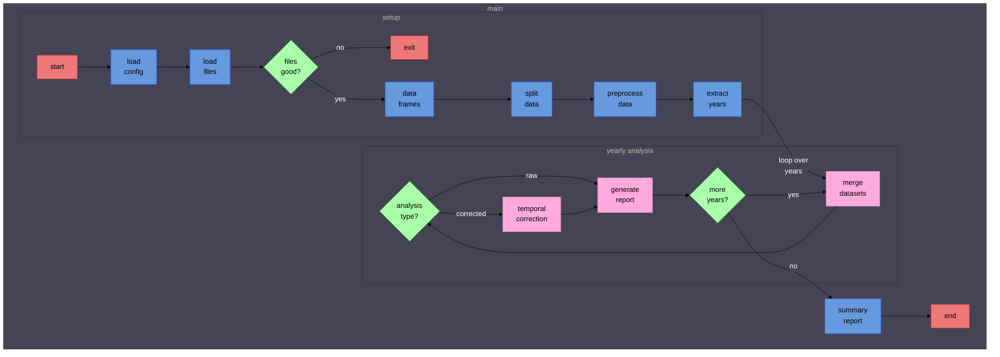
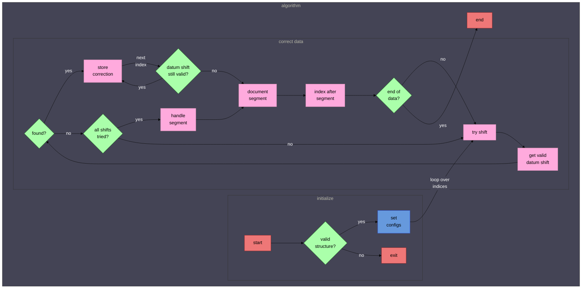

# Table of Contents

1. [Introduction](#introduction)
2. [Diagrams](#diagrams)
   - [Program processing loop](#program-processing-loop)
   - [Temporal correction algorithm](#temporal-correction-algorithm)
3. [Running the program](#running-the-program)
   - [Overview](#overview)
   - [Command line arguments](#command-line-arguments)
4. [Output](#output)
5. [Requirements](#requirements)
6. [Installation](#installation)
7. [Usage example](#usage-example)
8. [Configuration](#configuration)
   - [Overview](#overview-1)
   - [File location](#file-location)
   - [Configuration sections](#configuration-sections)
   - [Configuration values](#configuration-values)
   - [Default values](#default-values)
   - [Example configuration](#example-configuration)
9. [Technical details and limitations](#technical-details-and-limitations)
   - [Data requirements](#data-requirements)
   - [Dependencies](#dependencies)
10. [Downloading data](#downloading-data)
    - [NOAA data](#noaa-data)
    - [Lighthouse data](#lighthouse-data)

## Introduction

**noaa-lighthouse-problem** is a project aimed at assessing the discrepancies between time series water level data from tide gauge stations shared by NOAA and Lighthouse. In coastal Texas, some stations provide data to both organizations, but we have found significant discrepancies in the data available for download from these. Discrepancies include datum shifts and temporal offsets, missing values, flatlines, and spikes. Since NOAA sets the standard for data quality, it is crucial to understand why Lighthouse data differs so we can ensure the quality of data from Lighthouse stations *not* shared by NOAA.

The main program, `analyze_data.py`, uses class implementation from `MetricsCalculator.py` and `TransformData.py` to run a yearly comparison analysis on the water level data between NOAA and Lighthouse.

These processes are intended to be a starting point for diagnosing underlying issues that prevent Lighthouse from meeting the standards of NOAA.

**Note:** Not all Lighthouse stations are also NOAA stations. Additionally, Lighthouse stations are only located in coastal Texas, whereas NOAA stations are distributed across the United States. Ensure that you select comparable stations when running the analysis.

## Diagrams

### Program processing loop


### Temporal correction algorithm


## Running the program

### Overview

Running the main program, `analyze_data.py`, will generate text file and CSV reports for the comparison analysis done on the reference (NOAA) and primary (Lighthouse) data from two respective specified directories.

The `data` directory included in the repository has example CSV files that the program can handle. The program will process all of the files in the specified directories at once (e.g. `data/lighthouse/[station]` and `data/NOAA/[station]`) and then sort the data into years for yearly comparison. 

Importantly, the program offers two modes, or types of analysis: *raw* and *corrected*. Raw mode will run the analysis on the provided data. Corrected mode will first perform a temporal correction (with configurable parameters) to align the primary data with the reference data, and proceed with the comparison analysis on the corrected data. In either mode, the program can still report on the existing, or fixed, temporal shifts.

### Command line arguments

```shell
--config myConfig.json
```
- Specifies the file used to entirely configure the program. By default, the program will load `config.json`. See [Configuration](#configuration) to learn how to fill the fields in `config.json` to have the most control over the program execution. Some values from the configuration file are available to be overridden by command line arguments, listed below.

```shell
--filename myFileName
```
- Specifies the base file name of output files. The provided file name will be appended with the name of the type of report being generated (detailed in [Output](#output)).

```shell
--primarydir path/to/Lighthouse/data/files --refdir path/to/NOAA/data/files
```
- Specifies the path to the primary (Lighthouse) and reference (NOAA) data sources. The program will read all CSV files in these directories and then proceed with a yearly comparison analysis of the data. 

```shell
--years 2007 2008 2012 2021
```
- Stores the years desired for comparison. Defaults to `all_years`. Although all CSV files will be read in from the primary and reference directories, only data with years matching this argument will be processed in the comparison analysis.

```shell
--output path/to/output/files
```
- Specifies the output files location. Defaults to the `generated_files` directory.

```shell
--logging-off
```
- Opts out of logging the program execution. Logging is on by default.

```shell
--mode corrected
```
- Configures the analysis type for options `raw` and `corrected`. Defaults to `raw`.


## Output

The program can generate four different types of reports based on the data analysis, listed below. All output files are written to `generated_files` unless specified otherwise in `config.json` (see [Configuration](#configuration)) or by command line argument (see [Running the program](#running-the-program)).

- **Metrics summary**
   - Contains a table of metrics and statistics per year of the data, and lists the configuration options used.
   - Text file with file name `[base_filename]_metrics_summary.txt`.

- **Datum shift info**
   - Lists the start date/end date/duration and value of datum shifts filtered by duration (meeting the duration threshold) configured in the `filter_by_duration` section of `config.json`.
   - CSV file with filename `[base_filename]_[year]_datum_shift_info.csv`. This CSV report file is generated for each desired year.

- **Temporal shifts summary**
   - Contains a table listing the unique temporal shifts and datum shifts found per year of data.
   - CSV file with filename `[base_filename]_temporal_shifts_summary.csv`.

- **Annotated raw data**
    - A complete table of the raw primary and reference series data, annotated with the corresponding datum shift and temporal shift for each data point.
    - CSV file with filename `[base_filename]_annotated_raw_data.csv`.

## Requirements

Python 3.x<br>
Required packages (listed in `requirements.txt`)

## Installation

1. Clone the repository:
```shell
git clone https://github.com/ncail/noaa-lighthouse-problem.git
cd noaa-lighthouse-problem
```
2. Install the required packages:
```shell
pip install -r requirements.txt
```

## Usage example

1. Navigate to the project directory:
```shell
cd path/to/noaa-lighthouse-problem
```
2. Run the program:
```shell
python analyze_data.py
```

## Configuration

### Overview

`config.json` is used to configure:
- Paths to data and output directories
- Mode of data analysis.
- Desired years of analysis and reports to be generated
- Data-filtering metrics such as duration and value of datum shifts
- Temporal correction parameters
- Logging options

### File location

Place `config.json` (or your own copy, e.g. `myConfig.json`) in the root directory of your project.

### Configuration sections

- **Data**
  - Paths
    - `refdir`: Path to reference (NOAA) data CSV files. 
    - `primarydir`: Path to primary (Lighthouse) data CSV files.
  - Primary data column names
      - `datetime`: Name of the datetime column in the primary data CSV files.
      - `water_level`: Name of the water level column in the primary data CSV files.
  - Reference data column names
      - `datetime`: Name of the datetime column in the reference data CSV files.
      - `water_level`: Name of the water level column in the reference data CSV files.

- **Analysis**
  - `mode`: Selects the analysis type the program will run.
  - `years`: Stores a list of the desired years to run the analysis for. 

- **Output**
  - `base_filename`: This is the name that will be appended by the generated report type when creating the report output files.
  - `path`: Path to the desired output file location.
  - `generate_reports_for_years`: Each item in this section is a report type (see [Output](#output)). Enter the years you want each report type to be generated.

- **Filter offsets by duration parameters**
    - `threshold`: The duration required for a datum shift to persist for it to be quantified in the results file. 
    - `type`: Specifies if the threshold is a minimum or maximum cutoff.
    - `is_strict`: Specifies if the threshold is exclusive (strict) or inclusive.
    - `nonzero`: Toggles whether to exclude records of zero-valued datum shifts from quantified datum shifts meeting the duration threshold. 

- **Filter gaps by duration parameters**
    - `threshold`: The duration required for a gap (missing values) to persist for it to be quantified in the results file (the total missing values are also provided in the results). 
    - `type`: Specifies if the threshold is a minimum or maximum cutoff.
    - `is_strict`: Specifies if the threshold is exclusive (strict) or inclusive.

- **Filter offsets by value parameters**
    - `threshold`: The value of a datum shift required for it to be quantified in the results file.
    - `use_abs`: Specifies to use the absolute values of datum shifts to determine if they meet the threshold criteria.
    - `type`: Specifies if the threshold is a minimum or maximum cutoff.
    - `is_strict`: Specifies if the threshold is exclusive (strict) or inclusive.
    - `nonzero`: Toggles whether to exclude records of zero-valued datum shift from quantified datum shifts meeting the value threshold.

- **Temporal shift correction**
    - `number_of_intervals`: The number of intervals required for a datum shift to persist for a temporal shift to be identified. This is used by the temporal correction algorithm. Although this is a kind of duration, it is unrelated to the filter by duration processes.
    - `replace_with_nans`: For data that does not have a temporal shift resolvable by the temporal correction algorithm, toggle whether to replace with NaNs. The proceeding datum shift analysis will treat NaNs as gaps in the primary data. This is preferred if you want to regard data with an undetermined time shift as invalid.

### Configuration values

- `refdir`: Examples include: "data/NOAA/station14"
- `primarydir`: Examples include: "data/Lighthouse/station14"
- `datetime`: Examples include: "Date Time", "myDateTimeColumn"
- `water_level`: Examples include: "Water Level", "myWaterLevelColumn"
- `mode`: Must be "raw" or "corrected"
- `years`: Examples include: "all_years", [2001, 2002, 2007, 2008]
  - *These values are also examples for the fields in `generate_reports_for_years`*
- `threshold` (duration): Examples include:  "1 week", "2 days, 12 hours", "30 minutes"
- `threshold` (numeric): Must be numeric. Examples include: 0.05, 10.0
- `type`: Must be either "min" or "max"
- `is_strict`: Must be `true` or `false`
- `nonzero`: Must be `true` or `false`
- `use_abs`: Must be `true` or `false`

### Default values

Default values are used if a parameter is not specified in `config.json`:

- `data`: `paths`: `refdir`= "", `primarydir`= ""
- `data`: `primary_data_column_names`,`reference_data_column_names`: `datetime` = "", `water_level` = ""
- `analysis`: `mode`= "raw", `years`= ["all_years"]
- `output`: `base_filename`= "", `path`= "generated_files"
- `generate_reports_for_years`: `metrics_summary`= [], `metrics_detailed`= [], `temporal_shifts_summary`= [], `annotated_raw_data`= [] 
- `filter_offsets_by_duration`: `threshold`= "0 days", `type`= "min", `is_strict`= `false`, `nonzero`= `false`
- `filter_gaps_by_duration`: `threshold`= "0 days", `type`= "min", `is_strict`= `false`
- `filter_offsets_by_value`: `threshold`= 0.0, `type`= "min", `use_abs`= `true`, `is_strict`= `false`, `nonzero`= `false`
- `temporal_shift_correction`: `number_of_intervals`= 0, `replace_with_nans`: `true`

**Note**: For data column names that are left as default values, the program will assume the positions of the datetime and/or water level columns as the first and second column, respectively, in the CSV files. Check the data files to verify the order of the columns, or copy the names of the columns into `config.json`.

### Example configuration
```elixir
{
   "data": {
      "paths": {
         "refdir": "data/NOAA/rockport",
         "primarydir": "data/lighthouse/Rockport"
      },

      "primary_data_column_names": {
         "datetime": "",
         "water_level": ""
      },
   
      "reference_data_column_names": {
         "datetime": "",
         "water_level": ""
      }
  },

  "analysis": {
      "mode": "corrected",
      "years": [1999, 2000]
  },

   "output": {
      "base_filename": "Rockport_1999_2000",
      "path": "generated_files",

      "generate_reports_for_years": {
         "metrics_summary": [],
         "metrics_detailed": [1999, 2000],
         "temporal_shifts_summary": [],
         "annotated_raw_data": []
     }
   },

  "filter_offsets_by_duration": {
      "threshold": "1 hour",
      "type": "min",
      "is_strict": false,
      "nonzero": true
  },

  "filter_offsets_by_value": {
      "threshold": 0.001,
      "use_abs": true,
      "type": "min",
      "is_strict": false,
      "nonzero": true
  },

  "filter_gaps_by_duration": {
      "threshold": "1 day",
      "type": "min",
      "is_strict": false
  },

  "temporal_shift_correction": {
      "number_of_intervals": 10,
      "replace_with_nans": true
  }
}
```

## Technical details and limitations

### Data requirements

- **Data format**: Since the purpose of the program is to analyze the discrepancies between time series water level datasets, the data processed by the program should contain water level measurements with the corresponding timestamps over some time period. The data files must be in CSV format which will provide the data in columns.
- **Data columns**: The program will assume that the datetime and water level columns are the first and second columns in the data files, respectively. It will also assume that the first entry in the columns are the column names, and not data points.

### Dependencies

- **Libraries**: The program cleans and converts the data to `pandas` standards so that this does not have to be done by the user beforehand. Additionally, the program relies heavily on the `pandas` library to process the data as dataframes, with the assumed positioning of columns outlined above (in the default case that the necessary column names have not been configured in `config.json`).

## Downloading data

- **NOAA data**

   1. Visit the NOAA Tides & Currents website: [NOAA Tides & Currents](https://tidesandcurrents.noaa.gov/)
   2. Use the search bar or map to select a tide gauge station.
   3. Specify the date range, units, and datum for the data you want to download.
   4. Download the data in CSV format and save it to a directory, e.g., path/to/NOAA/files.

- **Lighthouse data**

   1. Access the Lighthouse data portal: [Lighthouse Data Portal]"(link?)"
   2. Locate the relevant tide gauge station and specify the date range, etc. for the data.
   3. Be sure to download the data in CSV format by selecting to download as "Comma-separated values."
